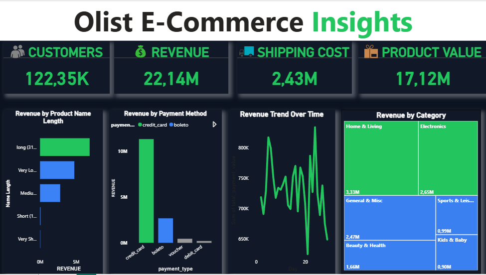

# 🛒 Olist E-Commerce Analytics — End-to-End Data Pipeline & Executive Dashboard



> **From 9 raw CSV tables to a validated executive dashboard — full pipeline built with Python, PostgreSQL, and Power BI.**

---

## 📌 Project Overview

This project delivers a full end-to-end analytics pipeline on the **Brazilian Olist E-Commerce dataset** — one of the most complex public datasets available, with 9 relational tables covering orders, customers, products, sellers, payments, reviews, and geolocation.

The goal was to answer real business questions an executive team would care about:
- Where is revenue coming from — by category, payment method, and over time?
- What is the relationship between product name length and revenue?
- How does shipping cost compare to product value?
- Are our KPIs trustworthy and validated?

---

## 🏗️ Pipeline Architecture

```
Raw CSVs (9 tables)
      │
      ▼
🐍 Python — Data Cleaning (per table)
      │
      ▼
🐘 PostgreSQL — Database Load + Feature Engineering
      │
      ▼
⭐ Star Schema — Master Dataset Build
      │
      ▼
📊 Power BI — Executive Dashboard
      │
      ▼
✅ SQL Validation — KPI Cross-Verification Report
```

---

## 📂 Repository Structure

```
olist-ecommerce-analytics/
│
├── data/
│   └── README.md                        # Link to Kaggle source dataset
│
├── scripts/
│   ├── 01_data_cleaning/
│   │   ├── clean_orders.py
│   │   ├── clean_customers.py
│   │   ├── clean_products.py
│   │   ├── clean_sellers.py
│   │   ├── clean_order_items.py
│   │   ├── clean_order_payments.py
│   │   ├── clean_order_reviews.py
│   │   ├── clean_geolocation.py
│   │   └── clean_product_category_translation.py
│   │
│   ├── 02_postgresql/
│   │   └── load_to_postgres.py          # DB connection + table creation + data load
│   │
│   ├── 03_feature_engineering/
│   │   └── feature_engineering.sql      # Derived columns, aggregations, transformations
│   │
│   └── 04_master_dataset/
│       └── build_star_schema.sql        # Final master dataset — star schema model
│
├── validation/
│   └── kpi_validation_report.md         # SQL queries + Power BI output matching
│
├── dashboard/
│   └── olist_dashboard.png              # Executive dashboard screenshot
│
└── README.md
```

---

## 🔧 Tech Stack

| Layer | Tool |
|---|---|
| Data Cleaning | Python (pandas, numpy) |
| Database | PostgreSQL |
| Feature Engineering | SQL (PostgreSQL) |
| Data Modelling | Star Schema (Fact + Dimension tables) |
| Visualisation | Microsoft Power BI |
| Validation | SQL queries cross-checked against Power BI KPIs |

---

## 🧹 Stage 1 — Data Cleaning (Python)

Each of the **9 raw CSV tables** was cleaned independently before being loaded into PostgreSQL.

**Per-table cleaning steps included:**
- Null value handling and imputation strategies
- Data type casting (dates, numerics, strings)
- Duplicate detection and removal
- Outlier flagging on pricing and freight columns
- Standardising categorical fields (e.g. product category names)
- Encoding fixes for Portuguese text fields

📁 Scripts: [`scripts/01_data_cleaning/`](scripts/01_data_cleaning/)

---

## 🐘 Stage 2 — PostgreSQL Database Load

After cleaning, all 9 tables were loaded into a **PostgreSQL** database using Python (`psycopg2` / `SQLAlchemy`).

- Tables created with correct primary keys and foreign key constraints
- Data types enforced at the database level
- Row count validation run post-load to confirm no data loss

📁 Script: [`scripts/02_postgresql/load_to_postgres.py`](scripts/02_postgresql/load_to_postgres.py)

---

## ⚙️ Stage 3 — Feature Engineering (SQL)

Feature engineering was performed directly in PostgreSQL to derive business-meaningful columns.

**New features created included:**
- `revenue` — calculated as `price + freight_value`
- `product_name_length_bucket` — binned product name lengths (Very Short, Short, Medium, Very Long, Long)
- `delivery_time_days` — difference between order purchase date and delivery date
- `order_month_year` — extracted for time-series trending
- `is_late_delivery` — boolean flag for orders delivered past estimated date
- `review_score_bucket` — grouped review scores for sentiment segmentation

📁 Script: [`scripts/03_feature_engineering/feature_engineering.sql`](scripts/03_feature_engineering/feature_engineering.sql)

---

## ⭐ Stage 4 — Star Schema / Master Dataset

A **star schema** master dataset was built in PostgreSQL to serve as the single source of truth for Power BI.

**Schema design:**

```
                    ┌─────────────────────┐
                    │    FACT_ORDERS       │
                    │─────────────────────│
                    │ order_id (PK)        │
                    │ customer_id (FK)     │
                    │ product_id (FK)      │
                    │ seller_id (FK)       │
                    │ payment_id (FK)      │
                    │ revenue              │
                    │ freight_value        │
                    │ order_month_year     │
                    └─────────────────────┘
                         │        │
           ┌─────────────┘        └──────────────┐
           ▼                                      ▼
  ┌─────────────────┐                  ┌─────────────────────┐
  │  DIM_CUSTOMERS  │                  │    DIM_PRODUCTS      │
  │─────────────────│                  │─────────────────────│
  │ customer_id     │                  │ product_id           │
  │ customer_city   │                  │ product_category     │
  │ customer_state  │                  │ name_length_bucket   │
  └─────────────────┘                  └─────────────────────┘
```

📁 Script: [`scripts/04_master_dataset/build_star_schema.sql`](scripts/04_master_dataset/build_star_schema.sql)

---

## 📊 Stage 5 — Power BI Executive Dashboard

The master dataset was connected directly to **Power BI** via the PostgreSQL connector.

### Dashboard KPIs

| Metric | Value |
|---|---|
| 👥 Total Customers | 122,35K |
| 💰 Total Revenue | R$ 22,14M |
| 🚚 Total Shipping Cost | R$ 2,43M |
| 🎁 Total Product Value | R$ 17,12M |

### Visuals Built

| Visual | Insight |
|---|---|
| Bar Chart | Revenue by Product Name Length |
| Bar Chart | Revenue by Payment Method (Credit Card vs Boleto vs Voucher vs Debit) |
| Line Chart | Revenue Trend Over Time |
| Treemap | Revenue by Product Category |

### Key Findings
- **Credit card** dominates payment methods — significantly higher revenue than all others combined
- **Home & Living** (R$3.33M) and **Electronics** (R$2.65M) are the top revenue categories
- **Longer product names** correlate with higher revenue — likely reflecting more complex/premium products
- Revenue trend shows strong **seasonality**, with notable peaks across the observation period

---

## ✅ Stage 6 — KPI Validation Report

> *This is the step most portfolio projects skip — every single Power BI metric was independently verified using SQL.*

Each dashboard KPI was re-calculated in PostgreSQL and the output was matched against the Power BI display value to confirm accuracy.

**Example validation (Total Revenue):**
```sql
SELECT
    ROUND(SUM(payment_value)::NUMERIC, 2) AS total_revenue
FROM olist_order_payments
WHERE order_id IN (
    SELECT order_id FROM olist_orders
    WHERE order_status = 'delivered'
);
-- Result: 22,135,xxx.xx ✅ Matches Power BI: 22.14M
```

📁 Full report: [`validation/kpi_validation_report.md`](validation/kpi_validation_report.md)

---

## 🚀 How to Reproduce

### Prerequisites
- Python 3.9+
- PostgreSQL 14+
- Power BI Desktop
- Libraries: `pandas`, `numpy`, `psycopg2`, `sqlalchemy`, `python-dotenv`

### Steps

```bash
# 1. Clone the repo
git clone https://github.com/YOUR_USERNAME/olist-ecommerce-analytics.git
cd olist-ecommerce-analytics

# 2. Install Python dependencies
pip install -r requirements.txt

# 3. Download raw data
# Visit: https://www.kaggle.com/datasets/olistbr/brazilian-ecommerce
# Place CSVs into the /data folder

# 4. Run cleaning scripts
python scripts/01_data_cleaning/clean_orders.py
# ... repeat for all 9 tables

# 5. Load to PostgreSQL (update your .env with DB credentials)
python scripts/02_postgresql/load_to_postgres.py

# 6. Run feature engineering + star schema
psql -U your_user -d your_db -f scripts/03_feature_engineering/feature_engineering.sql
psql -U your_user -d your_db -f scripts/04_master_dataset/build_star_schema.sql

# 7. Open Power BI Desktop and connect to your PostgreSQL master dataset
```

---

## 📦 Data Source

**Brazilian E-Commerce Public Dataset by Olist**
🔗 [https://www.kaggle.com/datasets/olistbr/brazilian-ecommerce](https://www.kaggle.com/datasets/olistbr/brazilian-ecommerce)

> Dataset contains ~100K orders from 2016–2018 across multiple Brazilian marketplaces.

---

## 👤 Author

**[Proud Ndlovu]**
📧 [fanisaproud@gmail.com]
🔗 [LinkedIn](https://www.linkedin.com/in/proud-ndlovu-89070854/)
🐙 [GitHub](https://github.com/ApostolicDA)

---

## 📄 License

This project is licensed under the MIT License — see [LICENSE](LICENSE) for details.
